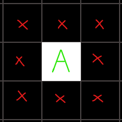

# El juego de la vida

En el año 1970 el matemático John Horton Conway diseño **El juego de la vida**, un ejemplo de autómata celular. El juego consiste en en una cuadricula de dos dimensiones que está conformada por células que pueden estar vivas o muertas, el estado de estas células puede cambiar de acuerdo a dos reglas:

- Si una célula está viva, puede mantenerse viva si tiene 2 o 3 vecinas con vida
- Si una célula está muerta, puede volver a la vida si tiene 3 vecinas con vida

***(Las células vecinas de una célula <u>A</u> son aquellas que rodean a esta célula)***

Para poder ejecutar el código es necesario instalar el modulo PyGame de Python

https://www.pygame.org/wiki/GettingStarted

